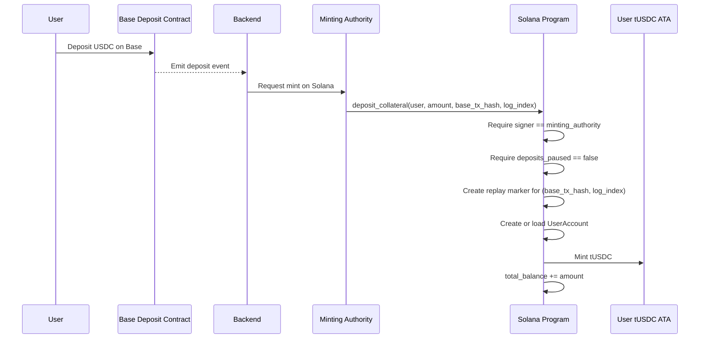
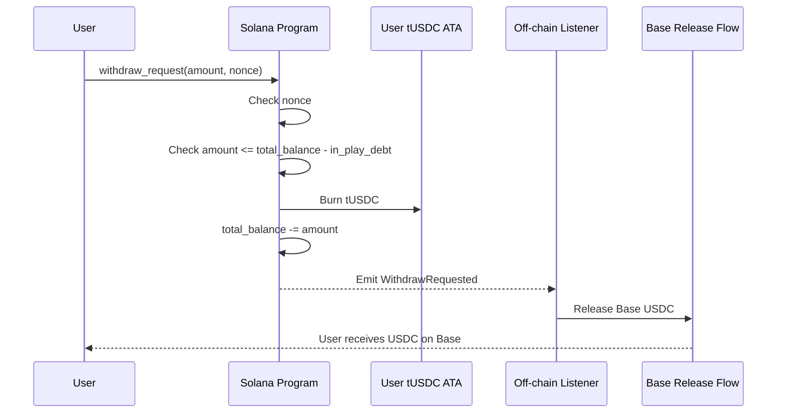
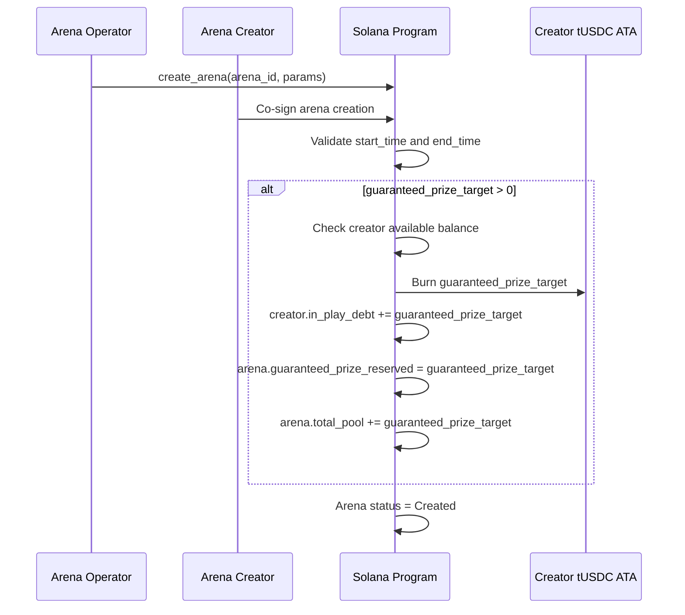
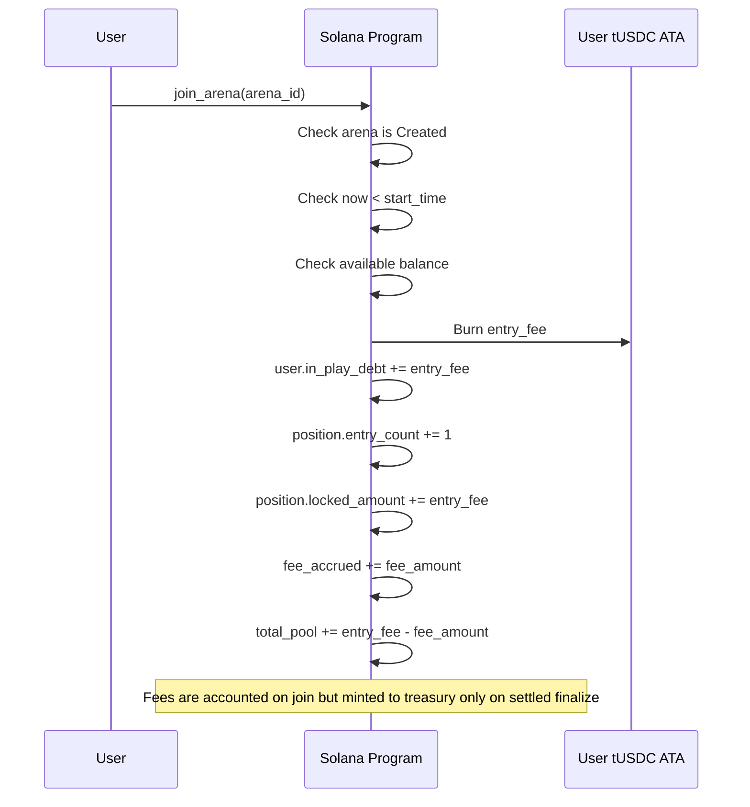
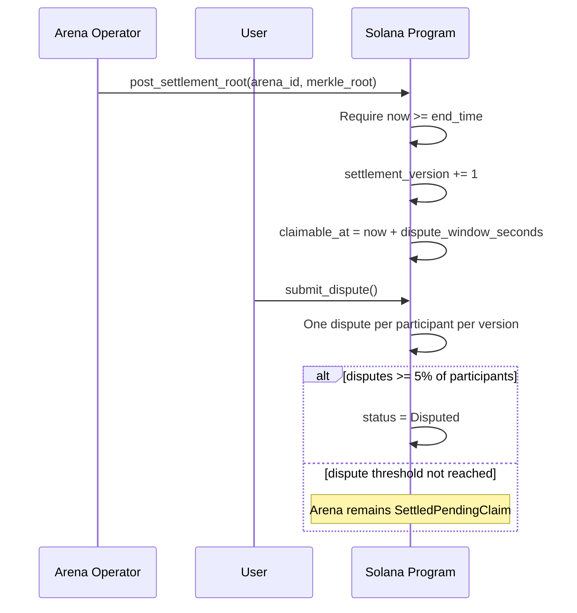
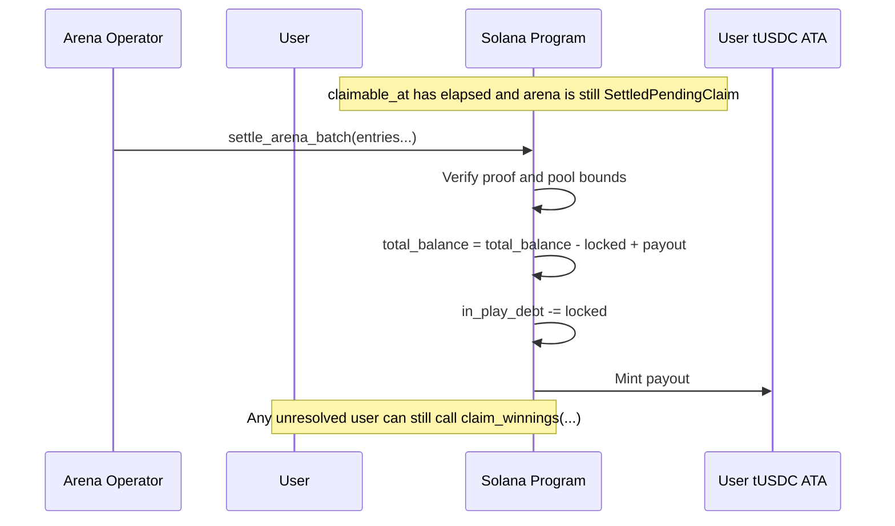
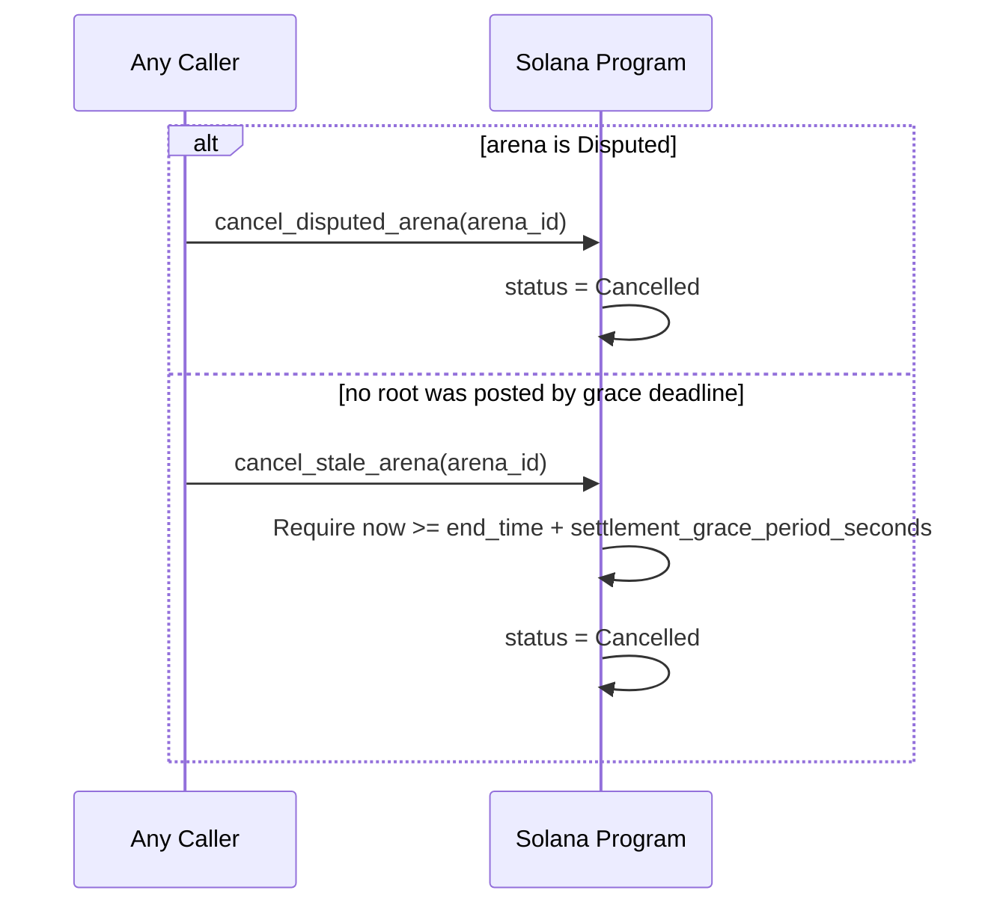
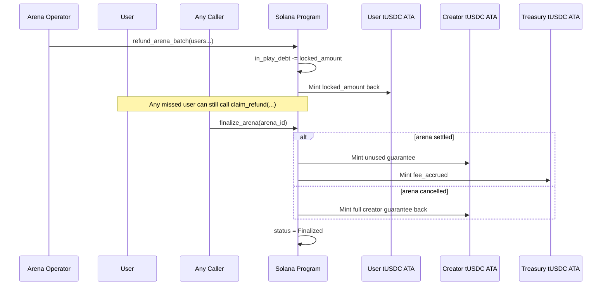
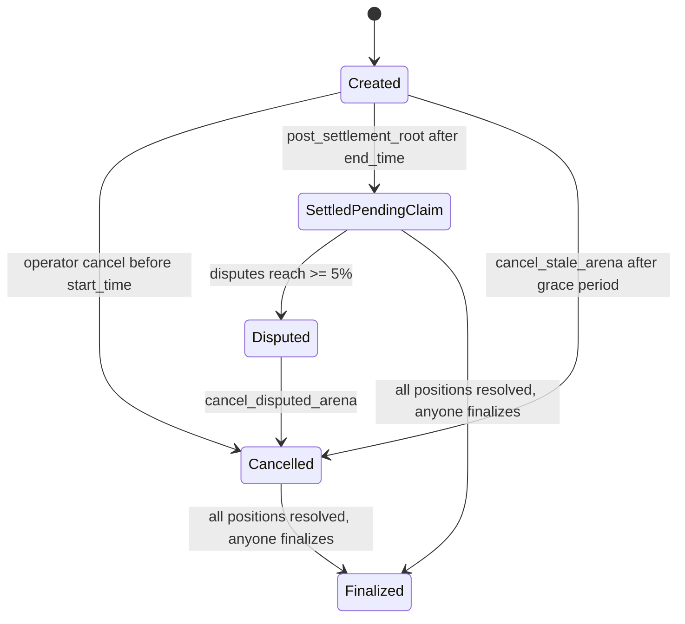

# Vault Architecture

## Overview

TradeStars uses Solana as the enforcement layer for mirrored balances, arena commitments, disputes, settlements, refunds, and withdrawal replay protection.

This version is intentionally simple:

- Base custody stays on Base.
- Solana mints `tUSDC` 1:1 through a dedicated Solana `minting_authority`.
- `tUSDC` is Token-2022 `NonTransferable`.
- Arena commitments are represented by immediate burns plus on-chain debt accounting.
- Guaranteed prizes are locked by the arena creator at creation time.
- The operator posts one immutable settlement root per arena.
- If disputes reach `>= 5%`, the arena becomes `Disputed` and can only refund.
- If the operator never settles, anyone can stale-cancel after the grace period.
- Once all positions are resolved, anyone can finalize.

There is no per-arena token vault.

## Base deposit flow

The Base contract and backend are still the source of truth for deposits, but Solana does not verify Base proofs on-chain in this version.

The flow is:

1. A user deposits USDC into the Base deposit contract.
2. The backend watches Base and decides the deposit is valid.
3. The backend calls `deposit_collateral` using the configured Solana `minting_authority`.
4. The Solana program checks:
   - caller is `minting_authority`
   - `deposits_paused == false`
   - replay marker for `(base_tx_hash, log_index)` does not already exist
5. The program mints `tUSDC` and increases `UserAccount.total_balance`.

This is a centralized minting model.

## Sequence diagrams

### Deposit



### Withdraw



### Create arena and lock guarantee



### Join arena and accrue fees



### One immutable settlement root



### Settle or fallback claim



### Disputed or stale cancellation



### Refund and finalize



## Authority model

- `authority`
  Initializes the platform, updates config, and can pause or resume deposits.
- `minting_authority`
  The only signer allowed to call `deposit_collateral`.
- `arena_operator`
  Creates arenas, posts settlement roots, settles batches, cancels pre-start arenas, and refunds batches.
- `treasury_wallet`
  Receives fees minted on settled finalization.

There is no multisig, attester signature verification, or on-chain root rewrite path in this version.

## Accounts

### `PlatformConfig`

Seeds:

```text
["config"]
```

Fields:

- `authority`
- `arena_operator`
- `treasury_wallet`
- `minting_authority`
- `dispute_window_seconds`
- `settlement_grace_period_seconds`
- `deposits_paused`
- `bump`

### `UserAccount`

Seeds:

```text
["user", user_pubkey]
```

Fields:

- `owner`
- `total_balance`
- `in_play_debt`
- `last_nonce`
- `bump`

Rule:

```text
available_to_withdraw = total_balance - in_play_debt
```

### `ArenaAccount`

Seeds:

```text
["arena", arena_id]
```

Fields:

- `arena_id`
- `creator`
- `status`
- `entry_fee`
- `fee_bps`
- `guaranteed_prize_target`
- `guaranteed_prize_reserved`
- `total_entry_fees_locked`
- `fee_accrued`
- `total_pool`
- `total_claimed_payout`
- `start_time`
- `end_time`
- `merkle_root`
- `settlement_timestamp`
- `claimable_at`
- `participant_count`
- `resolved_count`
- `dispute_count`
- `settlement_version`
- `metadata_hash`
- `bump`

Derived values:

```text
net_entry_pool = total_entry_fees_locked - fee_accrued
settlement_payout_cap = max(net_entry_pool, guaranteed_prize_reserved)
guaranteed_prize_used = max(total_claimed_payout - net_entry_pool, 0)
unused_guarantee = guaranteed_prize_reserved - guaranteed_prize_used
```

### `ArenaPosition`

Seeds:

```text
["position", arena_pubkey, user_pubkey]
```

Fields:

- `user`
- `arena`
- `entry_count`
- `locked_amount`
- `resolved`
- `last_disputed_settlement_version`
- `bump`

This is the canonical record that a specific user joined a specific arena.

## Arena lifecycle



## Instruction summary

### `deposit_collateral`

- minting-authority only
- rejected while `deposits_paused == true`
- replay-safe on `(base_tx_hash, log_index)`

### `create_arena`

- operator plus creator co-sign
- guaranteed prize is burned and locked immediately at creation

### `join_arena`

- user-signed
- allowed only while `status == Created` and `now < start_time`
- burns the full `entry_fee`

### `post_settlement_root`

- operator-only
- allowed only once, only after `end_time`
- starts the dispute window

### `submit_dispute`

- one dispute per participant per settlement version
- allowed only while `now < claimable_at`
- if disputes reach `>= 5%`, status becomes `Disputed`

### `cancel_stale_arena`

- permissionless
- allowed only from `Created`
- allowed only after `end_time + settlement_grace_period_seconds`

### `cancel_disputed_arena`

- permissionless
- allowed only from `Disputed`

### `settle_arena_batch`

- operator-only default payout path
- requires `status == SettledPendingClaim` and `now >= claimable_at`
- canonical PDA and canonical ATA checks are enforced in batch inputs

### `claim_winnings`

- user fallback payout path
- same settlement checks as the batch path

### `refund_arena_batch`

- operator default refund path for cancelled arenas

### `claim_refund`

- user fallback refund path for cancelled arenas

### `finalize_arena`

- permissionless once all positions are resolved
- settled finalize mints fees to treasury and unused guarantee back to creator
- cancelled finalize returns the full creator guarantee and mints no fees

## Security and trust notes

- Deposits are centralized. The configured `minting_authority` is trusted to mirror only real Base deposits.
- The replay marker prevents duplicate minting for the same `(base_tx_hash, log_index)`.
- The arena operator is trusted to publish the settlement root.
- The contract enforces payout bounds, replay protection, canonical PDAs, canonical ATAs in batch paths, and settlement/refund one-time resolution.
- Disputes do not produce corrected roots in this version. A disputed arena refunds instead.
